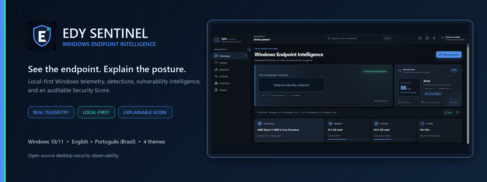
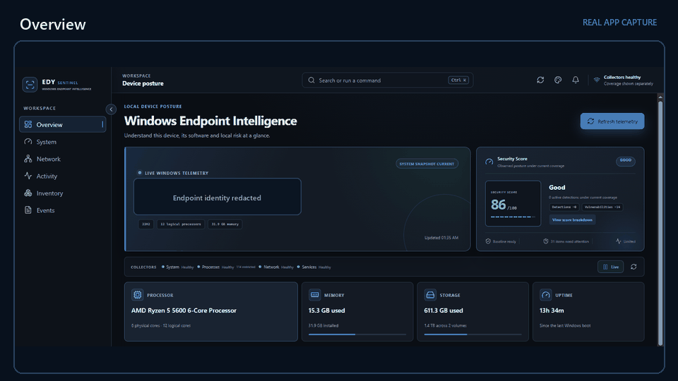
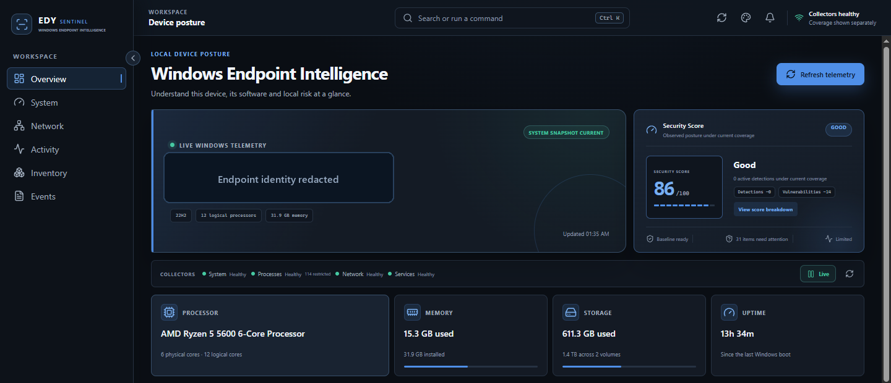
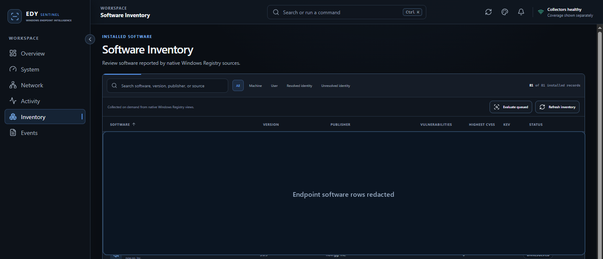
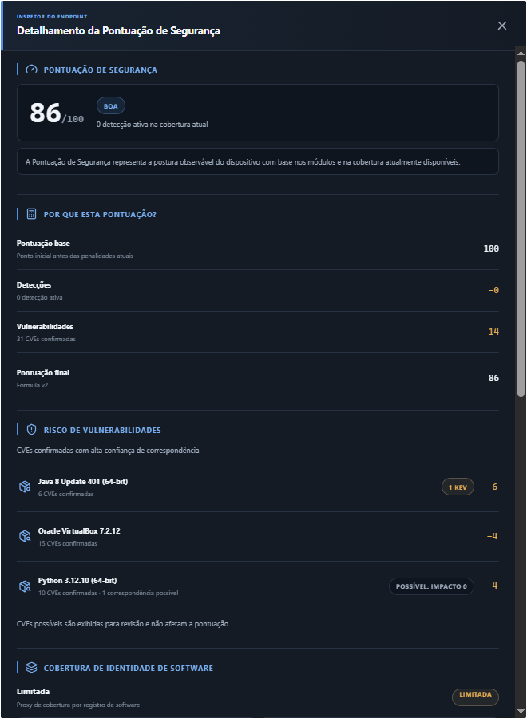
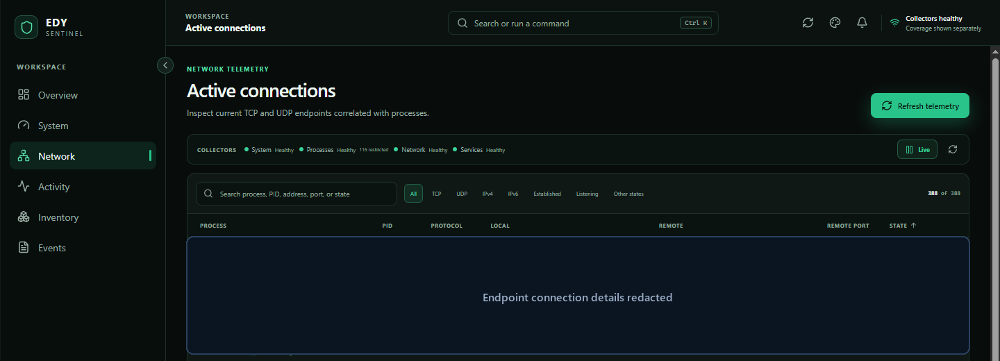
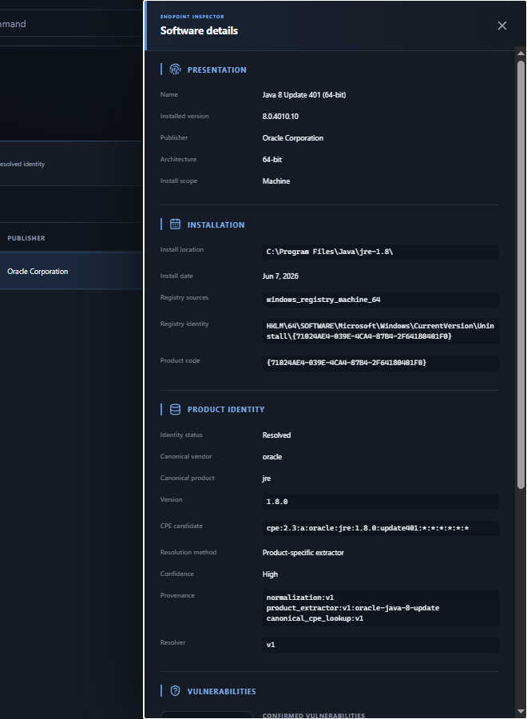
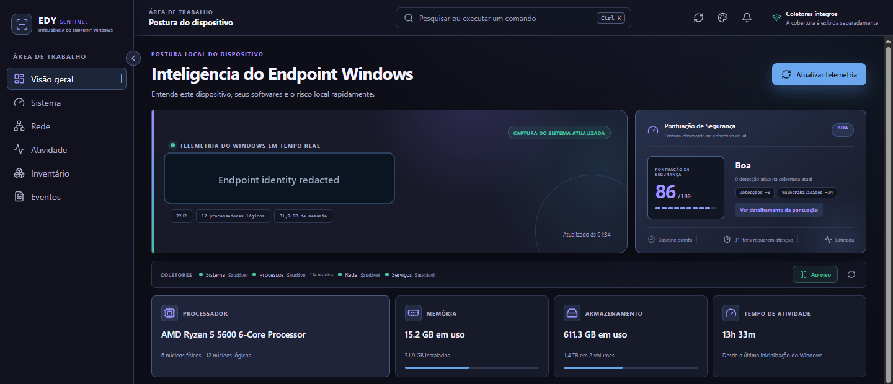

<p align="center">
  
</p>

<p align="center">
  <a href="README.md">English</a> ·
  <a href="docs/user/README.pt-BR.md">Português (Brasil)</a>
</p>

<p align="center">
  <a href="https://github.com/EDY075/EDY-Sentinel/releases/tag/v1.0.0"></a>
  
  
  
  
  <a href="https://github.com/EDY075/EDY-Sentinel/releases/latest"></a>
</p>

# EDY Sentinel

EDY Sentinel is a local-first Windows endpoint intelligence application. It brings real system
telemetry, behavioral context, explainable detections, software vulnerability intelligence, and
an auditable Security Score into one focused desktop workspace.

<p align="center">
  <a href="https://github.com/EDY075/EDY-Sentinel/releases/latest"><strong>Download EDY Sentinel for Windows →</strong></a>
</p>

> **Recommended:** [EDY-Sentinel-1.0.0-Setup-x64.exe](https://github.com/EDY075/EDY-Sentinel/releases/download/v1.0.0/EDY-Sentinel-1.0.0-Setup-x64.exe)
> for most users. The current v1.0.0 binaries are an **UNSIGNED BUILD**; Windows may display an
> unknown-publisher warning. Verify the published SHA-256 checksums before running a download.

## Quick install

1. Download the recommended [Setup EXE](https://github.com/EDY075/EDY-Sentinel/releases/download/v1.0.0/EDY-Sentinel-1.0.0-Setup-x64.exe).
2. Run the installer and follow the Windows prompts.
3. Open **EDY Sentinel** from the Start menu.

Alternative packages:

| Package | Best for |
|---|---|
| [Setup EXE](https://github.com/EDY075/EDY-Sentinel/releases/download/v1.0.0/EDY-Sentinel-1.0.0-Setup-x64.exe) | Recommended interactive installation |
| [MSI](https://github.com/EDY075/EDY-Sentinel/releases/download/v1.0.0/EDY-Sentinel-1.0.0-x64.msi) | Managed or conventional Windows installation |
| [Standalone EXE](https://github.com/EDY075/EDY-Sentinel/releases/download/v1.0.0/EDY-Sentinel-1.0.0-Standalone-x64.exe) | Advanced local QA and troubleshooting; not a portable package |
| [SHA256SUMS.txt](https://github.com/EDY075/EDY-Sentinel/releases/download/v1.0.0/SHA256SUMS.txt) | Download integrity verification |

Windows 10/11 x64 and the Microsoft Edge WebView2 Runtime are required. Internet access is optional
for endpoint monitoring and is used only when synchronizing public NVD and CISA KEV data.

## See it in action

<p align="center">
  
</p>

The demo uses sanitized captures from the real Tauri desktop application. Redaction labels identify
where private endpoint data was intentionally hidden; the visible interface and posture results were
not fabricated.

## Highlights

- **Windows telemetry** — observe hardware, storage, uptime, services, routes, adapters, and DNS.
- **Processes and connections** — inspect current processes and TCP/UDP endpoints with factual attribution.
- **Behavioral baseline** — learn a versioned local baseline with explicit Learning, Ready, Stale, and Error states.
- **Security Events** — retain factual endpoint changes separately from analytical conclusions.
- **Detection Engine** — evaluate six conservative v1 rules with evidence, exclusions, and history.
- **Software Inventory** — read installed software from native machine and user Registry views.
- **Vulnerability Intelligence** — resolve product identity and applicable CVEs without guessing ambiguous matches.
- **NVD + CISA KEV** — enrich confirmed local evidence using public vulnerability sources.
- **Security Score v2** — explain Detection and confirmed-vulnerability contributions under measured coverage.
- **Bilingual interface** — switch between English and Português (Brasil).
- **Four themes** — choose Sentinel Blue, Cyber Green, Terminal, or Spectrum.

EDY Sentinel reports unavailable, restricted, limited, or unresolved evidence as such. It does not
invent missing values or turn uncertainty into a threat verdict.

## Real application screenshots

### Endpoint posture



### Software inventory



### Security Score v2



This audited host view shows the formula directly: score 86, zero Detection penalty, a 14-point
confirmed-vulnerability contribution, 31 Confirmed CVEs, one Possible match with zero impact, and
one confirmed CISA KEV entry. Results vary with each endpoint and its available coverage.

### Network telemetry



### Endpoint Inspector



### Spectrum theme



## How it works

```text
Windows endpoint
      ↓
Native collectors
      ↓
Behavioral baseline + factual Security Events
      ↓
Detection Engine + Vulnerability Intelligence
      ↓
Explainable Security Score v2
```

React owns presentation; Rust owns collection, validation, persistence, detection, scoring, and
provider integration. The narrow Tauri boundary does not expose arbitrary shell, SQL, Registry,
WMI, file, or path operations to the interface.

[Explore the full architecture →](docs/technical/architecture.md)

## First run

EDY Sentinel begins collecting local telemetry after launch. The behavioral baseline starts in
**Learning**, so the Security Score can initially be unavailable or limited until the required
coverage is ready. Vulnerability Intelligence uses the existing local cache and can synchronize
public NVD/CISA records on request. These startup states are expected and are shown explicitly.

## Security and privacy

- Endpoint telemetry, inventory, baselines, events, detections, scores, and preferences stay in local SQLite databases.
- Process command lines are live-only and are not persisted; file contents are not collected.
- NVD and CISA synchronization downloads public advisory data over HTTPS and does not upload endpoint inventory.
- Version 1.0.0 has no product analytics, proprietary cloud telemetry, cloud account, or required API key.
- The application runs as the current user and provides observability; it does not block processes or modify system policy.

Treat the local databases as sensitive endpoint metadata. See the [security policy](SECURITY.md),
[code-signing boundary](docs/security/code-signing.md), and [vulnerability matching model](docs/technical/vulnerability-matching.md).

## Themes and languages

| Theme | Character |
|---|---|
| **Sentinel Blue** | Default neutral-blue security workspace |
| **Cyber Green** | Green functional accent with dark surfaces |
| **Terminal** | Restrained high-contrast terminal palette |
| **Spectrum** | Controlled violet and blue depth |

The full application is available in **English** and **Português (Brasil)**. Theme and language
preferences are stored locally.

## Documentation

| Start here | Deep dive |
|---|---|
| [User Guide](docs/user/user-guide.md) | [Architecture](docs/technical/architecture.md) |
| [Português (Brasil)](docs/user/README.pt-BR.md) | [Detection Rules](docs/technical/detection-rules.md) |
| [Documentation index](docs/README.md) | [Security Score](docs/technical/security-score.md) |
| [Release notes](docs/development/releases/v1.0.0.md) | [Vulnerability Matching](docs/technical/vulnerability-matching.md) |
| [Security policy](SECURITY.md) | [Localization](docs/technical/localization.md) |
| [Changelog](CHANGELOG.md) | [Development setup](docs/development/setup.md) |

Historical implementation reports remain available under
[`docs/development/history`](docs/development/history/) for project transparency, but are not
required to install or use the product.

## Build from source

Prerequisites are Node.js 20+, pnpm 10+, stable Rust MSVC, Visual Studio Build Tools with a Windows
SDK, and WebView2.

```powershell
git clone https://github.com/EDY075/EDY-Sentinel.git
cd EDY-Sentinel
pnpm install
pnpm tauri dev
```

Verification and release commands are documented in the [development guide](docs/development/setup.md).

## v1.0 scope and boundaries

EDY Sentinel v1.0 is a functional **Windows Endpoint Intelligence** and **Security Posture
Monitoring** product for local endpoint observation and analysis. Telemetry, processes, network,
services, software inventory, behavioral baseline, Security Events, the Detection Engine,
Vulnerability Intelligence, and Security Score are real, operational capabilities.

Within that defined monitoring and analysis scope:

- EDY Sentinel complements endpoint security operations; it is not intended to replace antivirus or a full EDR platform.
- Automated remediation, process or network blocking, reputation services, and complete EDR protection are outside the v1.0 scope.
- The Security Score represents observable posture under current coverage, not a guarantee of security.
- Software whose identity cannot be supported by sufficient evidence remains unresolved by conservative design.
- Offline operation preserves local capabilities and cached vulnerability evidence, but cannot refresh NVD/CISA data.
- Version 1.0.0 binaries remain an **UNSIGNED BUILD**, without authenticated publisher identity or a trusted timestamp.

## Project status

**v1.0.0** is the current public Windows release. Source and release artifacts are published as-is;
review the [release notes](docs/development/releases/v1.0.0.md) and verify checksums before use.
